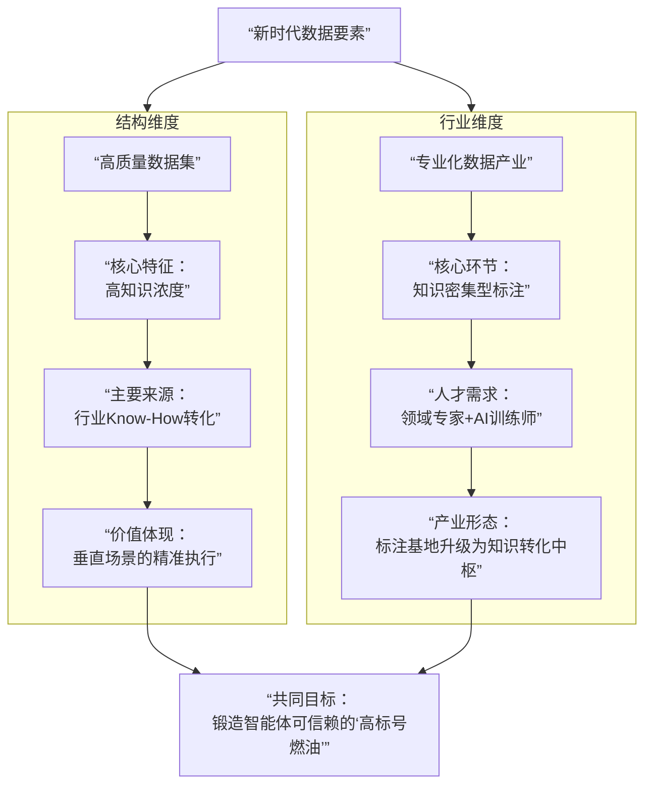

> 当AI从理解语言走向改造现实，驱动它的数据也必须从“数量”的汪洋，转向“质量”的深井。

人工智能的三要素——数据、算法、算力——正经历一场深刻的再平衡。随着大模型算法架构逐渐收敛，以及算力因规模化建设而日益普及，竞争的核心壁垒正**不可逆转地向下迁移**，落到了最基础、最难被标准化复制的要素上：**高质量、专业化的数据**。

数据不再是原始的“燃料”，而是经过精炼、标注、赋予行业知识的 **“高标号燃油”** ，直接决定了AI智能体能否从“纸上谈兵”走向“精准执行”。

---

## 01 范式迁移：从规模崇拜到质量至上

过去十年，AI发展曾深陷“规模陷阱”：更多数据、更大模型、更强算力。这一逻辑在“感知智能”时代成效显著。然而，当AI迈向需要深度推理、专业判断和复杂执行的**“认知智能”与“行动智能”** 阶段时，数据的“质”远比“量”更具决定性。

**核心转变在于**：
1.  **边际效益递减**：研究表明，当通用数据规模超过一定阈值后，其对模型性能的提升曲线急剧平坦化。继续堆砌网络文本和公开图片，已无法让AI更懂医疗诊断或工业故障预测。
2.  **专业化需求凸显**：智能体要在金融、法律、研发等垂直领域“办成事”，需要的是**浸透着行业默会知识、逻辑与规则**的数据。一份标注了“细胞异型性”的病理切片，其价值远超千万张普通的猫狗图片。
3.  **数据成为评估新标尺**：业界开始用“**数据密度**”和“**知识浓度**”来评估数据集价值。高质量数据集正在成为比算法模型更核心的资产，因其收集、清洗和标注过程融入了难以被简单复制的领域智慧。

## 02 产业升级：数据标注的知识化跃迁

数据价值的跃升，直接推动了数据标注产业的革命。这个曾经被视为劳动密集型的“数字流水线”，正在向**知识密集型**的“**行业知识转化中枢**”转型。

传统的“看图说话”式标注（如框出图中所有汽车）已无法满足需求。新时代的标注工作需要标注员扮演 **“领域专家助理”** 甚至 **“初级专家”** 的角色。

例如：
- **在自动驾驶领域**：标注员需要理解复杂交通场景中的优先级和潜在风险，不仅要标注车辆行人，还要标注“可能鬼探头的遮挡区域”、“施工路段的语义边界”。
- **在生物医药领域**：需要具备基础生物学知识的标注员，在电镜图像中精确区分细胞器的细微结构，或标注蛋白质相互作用的模式。
- **在金融风控领域**：需要标注员理解交易流水，识别其中隐藏的、符合特定欺诈模式的复杂关系链。

这种转变，使得数据标注基地不再是简单的成本中心。我国国家数据局在多个城市建设的数据标注基地，其核心目标正是汇聚地方产业特色和人才资源，打造**高质量、高价值的行业数据集高地**，将本土行业知识系统地转化为AI可训练的“数字养分”。

## 03 技术破局：合成数据的“无中生有”之道

当现实世界的高价值数据因**隐私、安全、成本或稀缺性**而难以获取时，合成数据技术应运而生，成为突破瓶颈的关键创新。

**合成数据并非简单的“造假”**，而是利用生成式AI（尤其是扩散模型、生成对抗网络等），在严格遵循真实世界物理规律、统计特性和业务逻辑的前提下，“酿造”出符合要求的数据。

其核心优势在于：
1.  **解决“数据荒”**：在自动驾驶的极端事故场景、医疗罕见病病例、工业设备故障样本等“长尾”领域，合成数据可以低成本、高效率地填补空白。
2.  **保护隐私与安全**：金融、医疗等领域，可以使用脱敏的合成数据进行分析和模型训练，从根本上避免原始敏感信息泄露的风险。
3.  **实现“完美标注”**：在虚拟环境中生成的数据，其标签天生就是100%准确的（例如，一个由3D引擎生成的车辆图像，其边界框和深度信息是精确已知的），避免了人工标注的误差。

当前，合成数据技术正从生成简单的图像、文本，向构建复杂的、多模态的、蕴含因果关系的**仿真环境与工作流数据**演进，为训练能在复杂现实中规划和行动的智能体提供了至关重要的“训练场”。

## 04 未来格局：数据生态的重构与挑战

高质量数据要素的崛起，正在重构AI产业链的价值分配和未来格局。

**拥有高质量专业数据的机构将占据价值链上游**。大型医院、顶尖实验室、龙头企业的历史数据，经过系统性的知识提取和合规处理，将成为价值连城的资产。数据交易所和交易模式也将随之演进，从交易原始数据转向交易**经过治理、标注、具有明确效用和价值的数据产品或服务**。

**“数据-算力-算法”的飞轮将因高质量数据而加速**。优质的专用数据将驱动算法在特定领域实现突破性进展，这些更精准的算法需要并能够更高效地利用算力，进而处理和分析更多、更复杂的数据，形成正向循环。

然而，挑战同样严峻：**数据的确权、定价、计量与收益分配**仍是全球性难题；在利用合成数据时，如何防止“模型崩溃”（生成模型因学习自身生成的数据而退化）和保证“仿真到现实的迁移”有效性，是需要持续攻克的技术关卡。

---

数据的这场“从量到质”的革命，其深刻程度不亚于任何一次算法突破。它标志着AI行业从追求“大而全”的通用智能，进入深耕 **“专而精”** 的行业智能时代。

未来，评价一个AI智能体的核心指标，不仅是它有多“聪明”，更是它有多 **“懂行”**。而这份“懂行”的能力，正来源于那些凝聚了人类数百年行业智慧、经过精心提炼的“高标号数据燃油”。

**当数据完成了从“燃料”到“燃油”的蜕变，AI才真正获得了驱动产业变革、而不只是激发对话火花的持久动力。** 这背后，是一场关于知识如何被定义、转化与赋能的深刻变革，它正在重新划定竞争优势的起跑线。