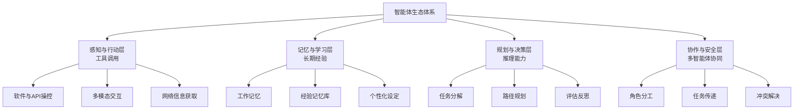

> 会议室里的投影上，一个AI智能体正自动分析报表、生成策略建议、预约团队会议并跟踪执行，而人类只需给出一个模糊的指令。这不再是科幻场景，而是正在发生的现实——人工智能的竞争焦点，已经从“能聊”转向了“能办事”。

当ChatGPT掀起的对话热潮逐渐回归理性，一场更为深刻的变革正在AI领域悄然发生。**硝烟弥漫的“百模大战”已成过去**，行业共识日益清晰：下一个战场并非谁的模型参数更多，而是谁能真正深入产业核心，将人工智能从“会说话的百科全书”转变为“能解决问题的智能伙伴”。

---

## 01 范式转移：从聊天窗口到行动伙伴

“帮我写一封邮件”和“确保我们的Q3营销预算在周五前获得所有部门批准”，这两条指令之间的区别，正是AI范式转移的核心体现。前者是**对话范式**，后者则是**行动范式**。

对话式AI如同一个博学的助理，能回答问题、生成文本，但每次互动都是独立的、反应式的。而智能体（AI Agent）更像一位**全权委托的合作伙伴**——它能理解开放式的目标，自主分解任务，规划步骤，调用工具，执行操作，并在过程中学习调整。

智能体的三大特征定义了这一根本转变。**自主性**使其能主动规划而非被动响应；**举一反三**的推理能力让它能处理未曾见过的复杂场景；**长期记忆**则让AI能积累经验，形成持续的协作关系，而非每次都“从零开始”。

## 02 技术演进：从大模型到智能体的关键跃迁

智能体范式的兴起，并非源于某种单一技术突破，而是多项能力汇聚的自然结果。大型语言模型为智能体提供了**理解、规划和推理的“大脑”**；工具调用能力赋予了它与现实世界交互的“手脚”；而记忆与个性化技术则塑造了它的“经验与性格”。

这一演进正沿两条主线并进。

**向上冲刺**的路径寻求更聪明的算法架构。研究人员正在探索如何增强模型的规划能力、多步骤推理能力，以及多智能体间的协同机制。DeepSeek等机构发布的相关研究，正是为了突破大模型训练中的内存瓶颈和稳定性难题，标志着技术路线向**更轻量化、高效率**演进。

**向下扎根**的道路则直面真实世界的痛点问题。从能自动诊断并修复代码错误的编程助手，到能理解企业工作流并自动执行跨系统任务的办公智能体，技术正变得越来越“接地气”。

上图展示了现代智能体生态的完整架构。这不再是一个简单的问答系统，而是一个由**多层能力堆叠**形成的复杂行动体系。

## 03 市场洗牌：从模型狂欢到应用深耕

2023年被称为“大模型元年”，全球涌现出数百个基础模型，形成了蔚为壮观的“百模大战”。然而仅仅一年后，市场已经开始理性和收敛。

**模型层的竞争格局逐渐固化**，少数几个领先者通过技术优势、生态建设和成本控制形成了壁垒。与此同时，真正的机会正在向下渗透到应用层。企业不再问“哪个模型得分更高”，而是问“这个AI能在我的业务中解决什么问题，能节省多少成本”。

行业正从一场爆发式的短跑，转变为一场围绕**真实场景渗透和产业生态构建的耐力赛**。评判标准也从炫技般的演示效果，转变为**实际的投资回报率和用户体验**。

这种转变催生了新的市场生态。一方面，出现了专门为企业提供垂直领域智能体解决方案的厂商；另一方面，传统软件公司正加速将AI能力集成到现有产品中。成败的关键，在于能否深入理解特定行业的工作流，并将其转化为智能体可执行的任务框架。

## 04 产业重构：从效率工具到新型生产力

当AI能够自主行动时，它不再仅仅是提高效率的工具，而是成为了一种**新型的生产力形态**。这种转变正在从三个层面重构产业。

**工作流程的重构**最为直接。传统上，人类在不同软件间切换、复制粘贴信息、手动触发流程。智能体范式下，人类只需要定义目标和约束，AI便能自动串联起整个工作流。例如，一个简单的指令“为新产品制定上市计划”，AI便能自动进行市场分析、竞品调研、预算编制、时间线规划，甚至预约相关人员会议。

**人机协作模式的重构**更为深远。过去的人机交互是“人类主导，机器执行”的层级关系；智能体时代则可能演变为“人类设定战略方向，AI自主执行战术细节”的伙伴关系。**中层管理中的许多协调、监督和传递工作**，可能正是AI智能体最能发挥价值的环节。

**组织形态的重构**最具想象力。未来的企业可能由少数人类决策者和大量AI智能体“员工”组成。这些AI员工各司其职——有的专注数据分析，有的擅长客户沟通，有的精于流程管理——它们之间也能高效协作，形成一个 **“人类-AI混合组织”**。

## 05 新职业版图：AI时代的人才需求变革

范式转移必然催生新的职业需求。随着AI从工具变为同事，一系列全新的岗位正在涌现。

**AI训练师/智能体教练**是这一转变的核心角色。他们的工作不再是优化单次对话的提示词，而是**为智能体设计目标函数、设定行为边界、构建评估体系**。就像体育教练一样，他们需要理解“球员”（智能体）的特点，制定训练计划，并在实际表现中不断调整策略。

**AI产品经理**的职责也发生了根本变化。传统产品经理定义的是用户界面和功能流程；AI时代的产品经理需要定义的是**人机协作的协议、任务交接的规则和异常处理的机制**。他们必须深刻理解人类如何思考工作，以及如何将这种思考过程转化为智能体可理解、可执行的结构化框架。

**AI伦理与安全审核员**的重要性空前提升。当AI能够自主行动时，其潜在风险也呈指数级增长。这些专业人员需要建立审计机制，监控智能体的行为是否符合伦理规范和安全要求，并设计干预方案。

即使是传统的程序员，其角色也在进化。编码能力虽然仍是基础，但更高阶的价值体现在**设计智能体可调用的工具接口、定义复杂任务的工作流架构，以及构建评估智能体表现的反馈系统**。开发越来越像“管理一支由AI组成的团队”。

## 06 挑战与边界：智能体发展的现实约束

尽管前景广阔，智能体的发展仍面临多重实质性挑战。**可靠性问题**首当其冲——在关键业务场景中，如何保证智能体99.99%的可靠执行？当前的智能体在复杂、开放环境中的表现仍不稳定。

**安全与责任边界**同样棘手。当智能体自主执行任务导致损失时，责任如何界定？是其开发者、使用者，还是模型提供方？这需要全新的法律和保险框架。

**成本与能耗**也不容忽视。持续运行的智能体对算力的需求远高于间歇性对话，这可能限制其大规模部署。最后，**人机信任的建立**需要时间——人们是否愿意将重要工作委托给AI，取决于其行为的可预测性和可解释性。

## 07 未来展望：智能体将如何重塑世界？

展望未来，智能体范式可能催生几个清晰的发展方向。**垂直领域将率先突破**，医疗、金融、法律等知识密集且流程规范的行业，将成为智能体的最佳试验场。

**多智能体协作系统**将日益成熟，形成能够内部协商、分工协作的“AI团队”。人机交互界面也将从图形用户界面转向**自然语言工作台**——人们通过对话管理所有数字工作，而智能体在后台操作各种软件和服务。

最具变革性的可能是**个性化AI伙伴**的出现。不同于今天的通用助手，未来的AI将深度了解特定用户的偏好、习惯和工作方式，成为真正个性化的数字分身，代表用户处理各类事务。

---

当人们还在讨论哪个聊天机器人更“聪明”时，硅谷的实验室里，智能体已在学习如何从零开始运营一家网店：它自动分析市场趋势、设计产品、管理供应链、处理客户咨询，甚至优化营销策略。整个过程人类只需偶尔监督。

**人工智能不再是需要精心提问才能给出答案的魔术箱，而是能够接过一个模糊目标，然后说“交给我吧”的合作伙伴。**

这场从“对话”到“行动”的范式转移，正将AI从科技展示柜带入真实世界的生产前线。它不是取代人类的“他者”，而是将成为人类认知与行动能力的延伸——就像工业革命放大了我们的体力，智能体革命将放大我们的脑力与执行力。

未来已来，只是分布尚不均匀。而那些最早理解并适应这一转变的个人与企业，将定义下一个十年的竞争格局。