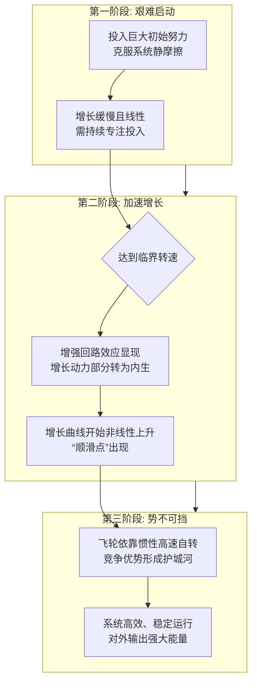

在商业战略与个人成长领域，“飞轮效应”已成为解释成功从何而来的核心模型。它描绘了一种**自我强化的增长循环**：一个系统通过一系列紧密耦合的环节，将上一环节的输出转化为下一环节的动力，初始启动虽然艰难，但一旦转动起来，动量会越来越大，最终形成势不可挡、高效运转的竞争优势。理解飞轮效应，不仅是为了解读成功，更是为了掌握如何设计并启动属于自己的增长引擎。

### **一、经典定义与物理隐喻**

“飞轮效应”的概念源于物理学中的飞轮——一个沉重的轮子，初始推动需要极大努力，但一旦高速旋转起来，其巨大的惯性会使它持续转动，难以停止，并能对外输出稳定而强大的能量。

在商业与管理中，这一概念由吉姆·柯林斯在其著作《从优秀到卓越》中系统阐述。他发现，实现跨越式发展的公司，并非依靠一次革命性的惊天创意或一个伟大领袖的瞬间决策，而是像持续推动一个巨大而沉重的飞轮一样，朝着一个明确方向，**持续、连贯地发力**。每一次努力（无论大小）都不会白费，它们累积起来，增加飞轮的动能。最终，在某个转折点，动量自身成为主要动力，飞轮开始高速、几乎自主地旋转，带来突破性的增长。

### **二、核心范例：亚马逊的超级飞轮**

最经典的商业飞轮模型非亚马逊莫属。杰夫·贝佐斯早在2001年就描绘了其增长飞轮，并以此为核心战略指引公司数十年。

亚马逊的飞轮是一个极其精妙的增强回路：
1.  **起点与核心**：**更低的价格**和**更丰富的选择**吸引更多**顾客体验**。
2.  **第一重增强**：更多的顾客流量吸引了更多的**第三方卖家**入驻平台。
3.  **第二重增强**：更多卖家进一步**丰富了商品选择**，并为了竞争而**提供更低价格**（同时平台向卖家收取的费用也增加了）。
4.  **关键转化**：庞大的销量和高效的物流中心网络，使得亚马逊的**固定成本（如仓储、服务器）被极致分摊**。
5.  **闭环与爆发**：更低的单位成本使得公司有能力**进一步降低商品价格**，或投资于更快的物流（如Prime服务）、更好的体验（如个性化推荐）。这又回到起点，吸引更多顾客，形成更强大的正向循环。

这个飞轮的魅力在于，它的每一个环节都在为下一个环节**注入动力**，且动力在循环中**不断被放大**。价格优势不是靠牺牲利润硬扛出来的，而是飞轮运转的自然结果。其本质是**将规模优势转化为成本优势，再将成本优势转化为客户体验优势，最终客户体验又反哺规模**，形成一个无法被竞争对手轻易复制的、具有强大护城河的动态系统。

### **三、机制解析：为什么飞轮能越转越快？**

飞轮效应并非简单的“越来越好”，其背后有深刻的系统动力学原理：

1.  **结构优势：增强回路的构建**  
    飞轮的核心是一个或多个首尾相连的“增强回路”。在系统思考中，增强回路是导致指数级增长或衰退的结构。亚马逊的飞轮就是一个典型的增强回路。每一次循环完成，系统的关键变量（如客户数、数据量、品牌认知）都变得比上一次循环开始时更强大，为下一次循环提供更大的初始势能。

2.  **边际成本递减与网络效应**  
    许多成功的飞轮都内嵌了这两种经济规律。
    - **边际成本递减**：如亚马逊，每新增一个顾客或一笔订单，分摊的IT和物流成本更低。
    - **网络效应**：如社交平台（Facebook）、内容平台（YouTube）。用户越多，平台对每个用户的价值越大（因为可连接的人、可看的内容更多），从而吸引更多用户，价值进一步增大。网络效应是驱动社交和平台型公司飞轮的核心燃料。

3.  **增长加速度：从线性到非线性**  
    飞轮启动初期，增长往往是线性的，需要持续投入巨大努力。但当飞轮转速达到临界点，各环节的协同效应和自动化程度极大提升，增长曲线会变得**非线性甚至是指数级**。此时的增长更多由系统内在动力驱动，而非外部强制输入。

为了更直观地理解这一从艰难启动到自我强化的全过程，我们可以通过以下流程图来洞察其动态机制：

### **四、应用边界：超越商业的普适智慧**

飞轮效应是一种强大的系统思维模型，其应用远不止于商业公司。

- **个人成长与学习**：  
  构建“学习-实践-复盘-能力提升-获得更好机会-进一步学习”的飞轮。初期坚持学习、刻意练习非常辛苦（推动沉重的飞轮），但当能力达到一定阈值，优质机会会主动找上门，实践反馈更频繁，成长速度就会骤然加快。

- **产品开发与用户体验**：  
  优秀产品吸引早期用户 → 用户反馈改进产品 → 产品更好吸引更多用户（口碑）→ 更多数据优化算法/功能 → 产品体验更具优势。许多 SaaS（软件即服务）公司的增长都遵循此道。

- **品牌建设**：  
  提供超预期体验 → 客户满意并成为推荐者（口碑/复购）→ 品牌认知度和信任度提升 → 吸引更多客户，同时降低企业的获客成本 → 有更多资源用于提供超预期体验。

- **组织管理与文化塑造**：  
  授予员工自主权与信任 → 员工责任感与创造力提升 → 产出更好业绩与创新 → 管理者更愿意放权，并吸引同类人才加入 → 形成高信任、高绩效的文化飞轮。

- **国家发展与科技创新**：  
  教育投入培养人才 → 人才推动科技创新与产业升级 → 高附加值产业带来更多税收与财富 → 增加教育、科研投入。这是一个长周期的国家竞争力飞轮。

### **五、关键挑战：如何启动你的飞轮？**

理解飞轮效应容易，但设计和启动它却无比艰难。最大的陷阱在于“第一推动力”。

1.  **找到正确的飞轮结构**  
    并非所有业务的环节都能形成增强回路。必须深刻洞察业务本质，识别出那些**能够相互催化、自我造血**的核心要素。错误的飞轮设计（例如，靠巨额补贴获取用户，但用户增长并未自然带来体验提升或成本下降）只会带来“空转”，消耗资源而无法积累势能。

2.  **承受漫长的“寂静区”**  
    在达到临界点之前，推动飞轮的付出可能远大于可见的回报。这需要极大的**战略定力与耐心**。许多公司或个人在此阶段因看不到即时反馈而放弃，或频繁改变方向，导致动量永远无法累积。

3.  **持续、连贯地发力**  
    飞轮的能量来自持续、同向的合力。最忌讳的是朝令夕改、左右摇摆。每一次推动，无论大小，都必须**沿着飞轮旋转的明确方向**。亚马逊二十多年如一日地坚持“客户体验”这个核心方向推动飞轮，是其成功的关键。

4.  **识别并利用“顺滑点”**  
    当飞轮明显变轻、转动开始依靠自身惯性时，这就是“顺滑点”。此时不应松懈，而应**顺势加大投入**，将资源倾注到最能加速飞轮的环节（如亚马逊在飞轮顺畅后大力投资AWS和Prime），实现突破性增长。

### **结语：在不确定中构建确定性**

飞轮效应为我们提供了一种在复杂、不确定的世界中构建长期确定性的思维框架。它告诉我们，伟大的成就很少源自孤注一掷的豪赌，而更多源于对简单而深刻的基本原理的坚持，以及日复一日、方向一致的持续推动。

它从物理学中借用的隐喻提醒我们：**世间强大的力量，往往始于最沉重的静默与最坚韧的启动。** 无论是经营一家企业、打造一款产品，还是规划个人生涯，重要的不是寻找捷径，而是设计出那个一旦转动起来就将带你前行的飞轮，然后，俯身，用力，推动它。当飞轮最终呼啸着自主旋转时，你会明白，所有的坚持都已被转化为势不可挡的动能。