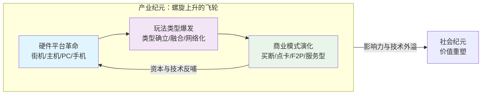

游戏，这一当代最主流的娱乐与文化形式，其发展脉络远非简单的“从单机到网络”线性叙事。它始于科学家实验室里闪烁的示波器光点，成长于全球产业的激烈竞争与商业创新，最终其影响力如江河入海，深刻渗透并重塑着我们的社会经济与文化认知。理解游戏，就是理解一部浓缩的现代科技跨界融合与大众文化跃迁史。

#### **第一纪元：科学纪元——实验室里的无心插柳**

在“娱乐产业”的概念诞生之前，游戏是计算机科学这棵大树上结出的第一颗意外果实。它的诞生，与人工智能、人机交互等前沿课题同根同源，一体两面。

**1. 学术探索的副产品**
早期的计算机是国之重器，用途仅限于弹道计算、密码破译等严肃任务。然而，科学家们的好奇心与幽默感催生了最初的游戏。1958年，美国物理学家威廉·希金博坦在布鲁克海文国家实验室的示波器上创造了《双人网球》，初衷是为了向公众展示“核研究不全是关于毁灭”。这款游戏被视为**第一个专为娱乐目的设计的电子游戏**。随后，1962年麻省理工学院学生史蒂夫·拉塞尔创作的《太空大战！》在PDP-1小型机上运行，它不仅是编程能力的炫技，更深远地**定义了电子游戏的核心语法：实时控制、太空战斗、分数系统**，其代码在早期的黑客社群中广泛流传，成为数字文化的火种。

**2. 人工智能的“数字沙盘”**
游戏从诞生起就是人工智能绝佳的试验场。因其规则明确、胜负分明，能清晰衡量AI的决策能力。国际象棋、围棋等古典棋类游戏，成为AI算法迭代的经典里程碑。从1997年IBM“深蓝”击败卡斯帕罗夫，到2016年谷歌“AlphaGo”战胜李世石，这些轰动世界的事件，本质上是**计算机科学在游戏这一封闭逻辑世界中的巅峰对决**。游戏作为“智能的镜子”，不断挑战并拓展着人类对机器思维的认知边界。

**科学纪元**的游戏，是象牙塔中的思想火花。它不追求商业回报，其价值在于**验证了“人机交互”的可能性**，并意外地为一种全新的、具有无限潜力的媒介形式，按下了历史的启动键。

#### **第二纪元：产业纪元——技术、玩法与商业的螺旋风暴**

当芯片技术、图形学与市场资本相遇，游戏便从实验室的奇观，蜕变为席卷全球的庞大产业。这是一个技术、创意与商业模式相互催化、螺旋式上升的黄金时代。

上图揭示了产业纪元的内生动力：**硬件是舞台，玩法是主角，商业是燃料**，三者形成的飞轮效应，驱动游戏产业滚滚向前。

**1. 硬件平台：定义时代的舞台**
每一次硬件跃迁都重塑了游戏的形态与受众。从街机厅的集体社交，到任天堂FC（红白机）将游戏搬进客厅，**家用主机定义了“家庭娱乐”**。个人电脑的普及，则催生了《文明》《魔兽世界》等需要复杂操作与深度思考的作品，孕育了核心玩家社群。而**智能手机的普及是决定性的“最后一公里”**，它让《愤怒的小鸟》《王者荣耀》触达数十亿用户，完成了游戏从亚文化到全民娱乐的惊险一跃。在中国，特殊的“游戏机禁令”政策，意外地加速了PC网游和手游的本土化繁荣，形成了独特的发展路径。

**2. 玩法类型：创意的生息与融合**
玩法是游戏的灵魂。产业早期是**类型奠基的时代**：《超级马里奥兄弟》定义了平台跳跃，《街头霸王II》奠定了格斗游戏的范本，《DOOM》点燃了第一人称射击的狂潮。进入3D与网络时代，玩法进入**融合与深化阶段**。《魔兽世界》构建了史诗般的虚拟社会，而《英雄联盟》《绝地求生》则分别引领了MOBA和战术竞技的全球风靡。近年来，“开放世界”与“电影化叙事”成为3A大作追求的高峰，而独立游戏则凭借《星露谷物语》《空洞骑士》等作品，在玩法创新和情感表达上持续带来惊喜。

**3. 商业模式：从产品到服务的演进**
商业模式的演变同样深刻。从一次买断，到《传奇》为代表的点卡计时，再到《征途》开创、被手游发扬光大的“免费游玩+内购”模式，盈利逻辑彻底改变。如今，以《堡垒之夜》《原神》为代表的 **“游戏即服务”模式成为主流**，通过持续数年的内容更新和运营，与玩家建立长期的情感连接和消费习惯。与此同时，Steam等数字分发平台彻底改变了发行规则，为独立开发者提供了直接面向全球市场的可能。

#### **第三纪元：社会纪元——超越娱乐的价值重塑**

当游戏积累的技术力、设计方法与用户规模达到临界点，其影响力便开始全面溢出“娱乐”的框架，进入社会经济的更广阔海域，引发深刻的“价值重塑”。

**1. “游戏技术+”的跨界赋能**
游戏引擎（如Unity、Unreal Engine）因其强大的实时渲染、物理模拟和交互能力，已成为重要的**新型工业软件**。它被用于：
*   **文保与教育**：敦煌研究院与腾讯合作，利用游戏引擎进行石窟的高精度数字复原，让千年艺术得以永存并沉浸式展示。
*   **产业仿真**：在汽车设计、城市规划、自动驾驶测试等领域，游戏技术构建的“数字孪生”环境，成为低成本、高效率的测试与培训平台。
*   **科研助力**：游戏对图形处理和高并发网络的极致需求，曾强力拉动GPU与通信技术的发展。研究显示，2020年游戏技术对芯片、5G和VR/AR产业的科技进步贡献率分别达到14.9%、46.3%和71.6%。

**2. 社会认知的“正名”与主流化**
游戏的社会形象走过了漫长的“正名”之路。它曾饱受“电子海洛因”的污名化困扰。但随着用户基数的扩大（中国玩家规模超6亿）、电竞入亚带来的体育化认可、以及如《黑神话：悟空》般承载文化输出使命的杰作出现，游戏作为 **“第九艺术”的复杂性和文化价值**正获得前所未有的承认。它既是流行文化的风向标，也是连接年轻一代的情感纽带。

#### **未来：在技术的浪尖与人文的锚点之间**

展望未来，游戏将继续在技术前沿探索。**云游戏**致力于让高品质游戏摆脱硬件桎梏；**VR/AR/MR** 追求更深度的沉浸与虚实融合；而 **AI** 将不仅塑造更智慧的NPC，更可能从根本上改变游戏内容的生成方式，甚至成为共创伙伴。

然而，比技术更重要的，是发展的方向盘。我们需共同思考：如何在追求极致体验的同时，守护玩家的心理健康与隐私数据？如何在虚拟世界中建立合理的伦理与规则？如何让游戏这股强大的力量，更持续地激发创造力、促进理解与连接，而非加剧沉迷与对立？

从实验室的一个光点，到照亮全球的数字星河，游戏的发展史，本质上是一部人类如何将想象力、技术力与商业智慧相结合，不断创造新世界、并重新定义自身与世界关系的历史。它始于科学，兴于产业，最终归于对人类自身处境的深刻关怀与探索。这，正是游戏最深邃的魅力与潜力所在。