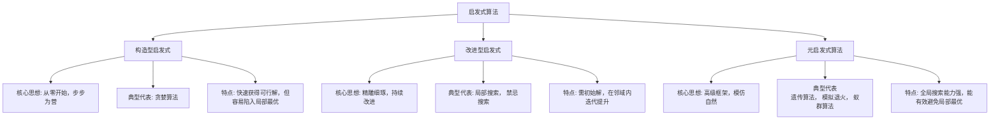

在计算机科学和运筹学领域，我们常常面对一些令人望而生畏的复杂问题：如何为上万个包裹规划最省油的配送路线？如何为上百万个晶体管设计最优的电路布局？如何为瞬息万变的股市找到最佳的交易策略？

这类问题在数学上通常被归类为 **NP难（NP-hard）问题**。其残酷之处在于，当问题规模（比如城市数量、晶体管数目）稍微增大时，寻找**理论绝对最优解**所需的时间便会呈指数级爆炸。即使动用全世界的计算资源，穷尽所有可能，所需时间也可能超过宇宙的寿命。这构成了现代计算中一个根本性的困境：**我们追求完美，但时间和资源永不完美。**

正是在这种“最优不可得”的困境中，启发式算法闪耀出其实用主义的光芒。它放弃了对“数学完美”的执念，转而拥抱一种更为智慧的哲学：**在有限的时间内，找到一个足够好的、可行的解决方案。**

#### **一、核心思想：从“穷举”到“引导”的范式转移**

想象一下，你被空投到一个巨大、结构未知的迷宫中央，目标是找到出口。穷举法（精确算法）的策略是：系统性地探索每一条岔路，并绘制完整地图，最终证明哪条路最短。这个方法绝对正确，但可能在你饿死之前都无法完成。

而启发式算法则像是一位经验丰富的探险家。他可能遵循一些实用的“经验法则”：
1.  **“贴着右手墙走”**：这是一个简单的确定性规则，虽不保证最短，但大概率能带你走出去。
2.  **“高处走”**：假设出口在海拔高处，通过不断向更高处探索来寻找。这利用了问题领域的**启发信息**。
3.  **“放出一群探路鼠”**：从多个随机点出发，让它们各自探索并交流信息，最终综合出路径。

**这就是启发式算法的精髓：** 它不是盲目的搜索，而是利用针对特定问题的**经验、直觉、规则或智能策略**，来**引导**搜索过程朝着最有希望的方向前进。它的目标不是找到那座唯一的“最高峰”（全局最优），而是高效地发现一座“足够高的山峰”（满意解）。

为了系统地理解各类启发式方法，我们可以将其大致归入以下三大类别，它们共同构成了解决复杂优化问题的工具箱：



上图展示了启发式算法的三大主要类别。**构造型**和**改进型**启发式通常针对特定问题设计，而**元启发式**则提供了更高层次的、可广泛应用于各类问题的智能搜索框架。接下来，我们将深入探究几种最具代表性的元启发式算法，它们的设计灵感直接源于我们对世界的观察。

#### **二、原理探究：三大经典算法的智慧之源**

**1. 遗传算法：物竞天择的数字演化**
灵感直接来源于达尔文的生物进化论。
*   **核心流程**：它将一个潜在解编码成一条“染色体”（如二进制串）。算法初始化一个包含多条染色体的“种群”，然后通过**适应度函数**（对应问题的目标函数，如路径越短适应度越高）评估其优劣。随后，模拟自然选择，让优质个体有更高概率通过**交叉**（交换基因片段）和**变异**（随机改变个别基因）产生“后代”，从而迭代演化出越来越好的解。
*   **哲学意义**：它证明了**通过简单的选择、重组和突变规则，无需中央指挥，群体智慧就能在复杂空间中高效地发现优质解**。它被广泛应用于自动设计、参数调优和机器学习中。

**2. 模拟退火算法：百炼成钢的淬火哲学**
灵感来自冶金学中的退火工艺：将金属加热至高温后缓慢冷却，使其原子获得足够能量跳出局部排列，最终形成更稳定的低能态晶体结构。
*   **核心流程**：算法从一個初始解和一個高“温度”参数开始。在每次迭代中，它会在当前解的附近随机产生一个新解。如果新解更好，则接受它；如果更差，则会以一个与温度和差解程度相关的**概率**接受它。这个概率随着“温度”的缓慢降低而减小。
*   **关键洞见**：**概率性地接受“坏解”是其灵魂所在**。这赋予了算法暂时跳出局部最优“山谷”、去探索远处可能存在的全局最优“高峰”的能力。它特别适合求解旅行商问题、芯片布局等组合优化问题。

**3. 蚁群算法：群体协作的间接通信**
模仿蚂蚁觅食时展现的群体智能。单只蚂蚁能力简单，但蚁群通过信息素这种化学物质进行间接通信，能协同发现巢穴与食物源之间的最短路径。
*   **核心流程**：人工“蚂蚁”被释放到问题图（如城市网络）中随机行走，并根据路径上“信息素”浓度和启发式信息（如距离倒数）概率选择下一步。当一批蚂蚁完成一次循环（如走遍所有城市），它们会在自己走过的路径上释放与解质量成正比的信息素。同时，信息素会随时间挥发。最终，优质路径上的信息素因被不断补充而增强，劣质路径上的信息素则逐渐消失，从而引导整个蚁群收敛到优质解。
*   **哲学意义**：它揭示了**通过简单个体遵循局部规则，并在环境中留下正反馈，就能涌现出复杂的、优化的全局行为**。这是分布式人工智能的典范，广泛应用于动态车辆路径规划、网络路由优化。

#### **三、代码演示：用遗传算法求解经典旅行商问题**

旅行商问题（TSP）是组合优化领域的“Hello World”：给定一系列城市和距离，求解访问每座城市一次并回到起点的最短回路。我们使用Python实现一个简化版的遗传算法。

```python
import numpy as np
import matplotlib.pyplot as plt

# 1. 问题定义：随机生成10个城市的坐标
num_cities = 10
cities = np.random.rand(num_cities, 2) * 100  # 坐标在[0,100)区间

# 计算两个城市间的欧氏距离
def calculate_distance(city_a, city_b):
    return np.linalg.norm(city_a - city_b)

# 计算一条路径（染色体）的总长度（适应度：距离越短，适应度越高）
def calculate_total_distance(route):
    total_dist = 0
    for i in range(num_cities):
        from_city = cities[route[i]]
        to_city = cities[route[(i + 1) % num_cities]]  # 回到起点
        total_dist += calculate_distance(from_city, to_city)
    return total_dist

# 2. 遗传算法参数
population_size = 50  # 种群大小
num_generations = 500 # 迭代代数
mutation_rate = 0.1   # 变异概率

# 初始化种群：每个个体是一个随机的城市排列
def create_random_route():
    route = np.arange(num_cities)
    np.random.shuffle(route)
    return route

population = [create_random_route() for _ in range(population_size)]

# 用于记录每一代的最优解
best_distance_history = []

# 3. 进化主循环
for generation in range(num_generations):
    # 计算适应度（这里用距离的倒数表示，距离越短适应度越高）
    fitness = np.array([1.0 / calculate_total_distance(route) for route in population])
    
    # 记录当代最佳解
    best_idx = np.argmax(fitness)
    best_route = population[best_idx].copy()
    best_distance = calculate_total_distance(best_route)
    best_distance_history.append(best_distance)
    
    # 选择（轮盘赌选择法）：适应度高的个体有更高概率被选中成为父母
    selected_indices = np.random.choice(
        population_size, size=population_size, 
        p=fitness/fitness.sum()  # 归一化为概率
    )
    selected_population = [population[i].copy() for i in selected_indices]
    
    # 交叉（有序交叉OX）：从父母产生后代
    new_population = []
    for i in range(0, population_size, 2):
        parent1, parent2 = selected_population[i], selected_population[i+1]
        # 随机选择交叉点
        start, end = sorted(np.random.choice(num_cities, 2, replace=False))
        # 创建子代，初始用-1填充
        child1, child2 = [-1]*num_cities, [-1]*num_cities
        # 复制父代的交叉段到子代
        child1[start:end+1] = parent1[start:end+1]
        child2[start:end+1] = parent2[start:end+1]
        # 填充剩余城市，保持顺序
        fill_position = lambda child, parent: [
            city for city in parent if city not in child
        ]
        remaining1 = fill_position(child1, parent2)
        remaining2 = fill_position(child2, parent1)
        ptr1 = ptr2 = 0
        for j in range(num_cities):
            if child1[j] == -1:
                child1[j] = remaining1[ptr1]
                ptr1 += 1
            if child2[j] == -1:
                child2[j] = remaining2[ptr2]
                ptr2 += 1
        new_population.extend([child1, child2])
    
    # 变异（交换突变）：随机交换两个城市
    for route in new_population:
        if np.random.rand() < mutation_rate:
            swap_idx1, swap_idx2 = np.random.choice(num_cities, 2, replace=False)
            route[swap_idx1], route[swap_idx2] = route[swap_idx2], route[swap_idx1]
    
    population = new_population  # 新一代成为当前种群
    
    # 每100代打印进度
    if generation % 100 == 0:
        print(f"代 {generation}: 最短距离 = {best_distance:.2f}")

# 4. 输出最终结果并可视化
final_best_idx = np.argmax([1.0 / calculate_total_distance(route) for route in population])
final_best_route = population[final_best_idx]
final_best_distance = calculate_total_distance(final_best_route)
print(f"\n最终结果 - 最短路径距离: {final_best_distance:.2f}")
print(f"访问顺序: {final_best_route}")

# 绘制优化过程收敛曲线
plt.figure(figsize=(12, 5))
plt.subplot(1, 2, 1)
plt.plot(best_distance_history, linewidth=2)
plt.xlabel('Generation')
plt.ylabel('Best Distance')
plt.title('GA Optimization Process')
plt.grid(True)

# 绘制最优路径图
plt.subplot(1, 2, 2)
# 按顺序连接城市
ordered_cities = cities[final_best_route]
ordered_cities = np.vstack([ordered_cities, ordered_cities[0]])  # 回到起点
plt.plot(ordered_cities[:, 0], ordered_cities[:, 1], 'o-', linewidth=2, markersize=8)
plt.scatter(cities[:, 0], cities[:, 1], s=100, c='red', zorder=5)
for i, (x, y) in enumerate(cities):
    plt.text(x+1, y+1, str(i), fontsize=12)
plt.xlabel('X Coordinate')
plt.ylabel('Y Coordinate')
plt.title(f'Best TSP Route (Distance: {final_best_distance:.2f})')
plt.tight_layout()
plt.show()
```

这段代码清晰地展示了遗传算法的核心步骤：**初始化种群 → 评估适应度 → 选择优秀个体 → 交叉产生后代 → 变异引入多样性**。通过反复迭代，种群中的路径质量逐步提升。运行代码后，你会看到一条逐渐收敛的距离曲线和一张直观的最优路径图。

#### **四、启发式 vs. 精确：一场哲学与实用的对话**

| 维度 | 启发式算法 | 精确算法（如分支定界、动态规划） |
| :--- | :--- | :--- |
| **目标** | **满意解**：高质量、可行、及时 | **最优解**：数学证明的全局最优 |
| **耗时** | **多项式时间**，可随规模可控增长 | **指数时间**，规模稍大即不可行 |
| **保证** | **通常无理论最优性保证** | **有严格的最优性证明** |
| **核心思想** | **利用启发信息引导搜索**，模仿自然或物理过程 | **系统枚举或数学推导**，确保覆盖所有可能 |
| **适用场景** | **大规模、复杂、实时**的NP难问题（物流、调度、AI调参） | **小规模、精确建模**的问题，或作为理论基准 |

它们的对比，本质上是**工程务实思维**与**数学完美主义**的对话。在现实世界中，当“最优”成为奢望时，“满意”便是最高智慧。启发式算法正是这种智慧的结晶。

#### **五、应用全景：从虚拟到现实的广泛赋能**

今天，启发式算法已渗透到现代社会的各个角落：
*   **物流与交通**：UPS、亚马逊等公司利用其规划每日数百万包裹的投递路线，节省数以亿计的燃油成本。
*   **生产制造**：工厂用它优化生产线调度、物料切割，以最小化等待时间和材料浪费。
*   **人工智能**：它是训练深度学习模型时进行超参数调优的利器（如AutoML），也是AI在游戏中做出决策的核心（如棋类游戏的评估函数）。
*   **芯片设计**：在纳米尺度上，模拟退火等算法帮助安排数十亿晶体管的位置与连线。
*   **金融分析**：用于构建投资组合、预测市场趋势和进行高频交易策略优化。

#### **结语：在不确定性的海洋中航行**

启发式算法不仅仅是一套工具，它更代表了一种应对复杂世界的根本方法论。在充满不确定性和计算局限性的海洋中，它不追求绘制完整海图，而是教会我们如何利用风向、星象（启发信息）和经验法则，快速、稳健地驶向目的地。它承认人类和机器的有限性，并在此基础上，将有限理性转化为强大的实践力量。从某种意义上说，我们每一次在纷繁选项中做出快速而有效的决策，大脑也在运行着某种精妙的“启发式算法”。这正是这一领域最迷人之处：它既是计算机科学，也是关于我们自身如何思考与决策的一面镜子。