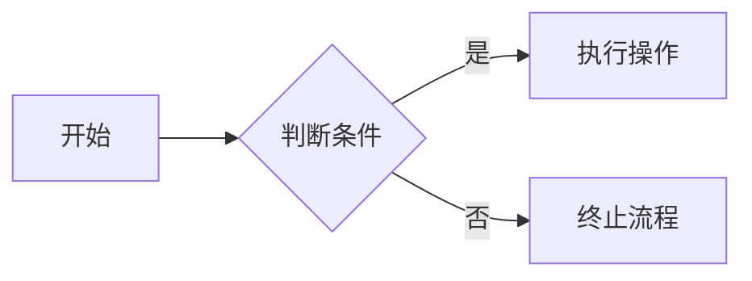
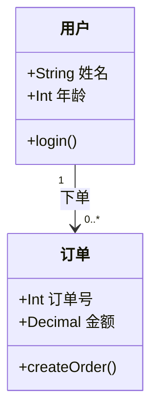
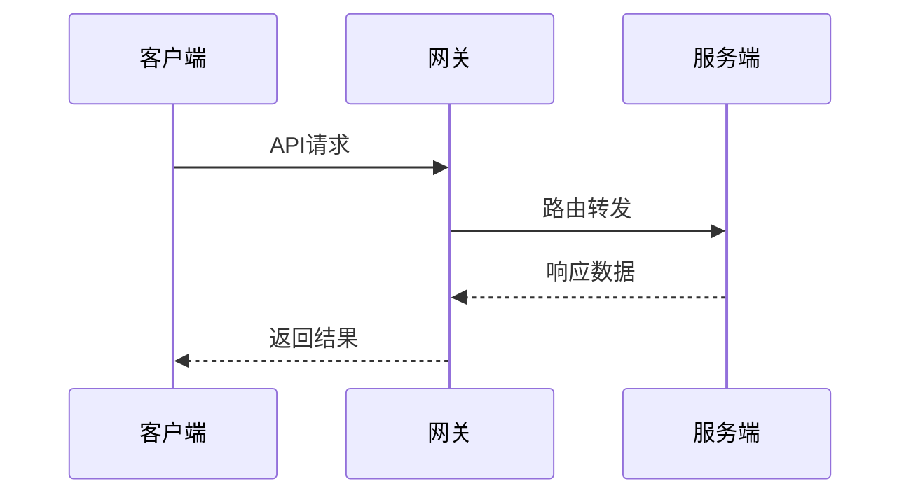
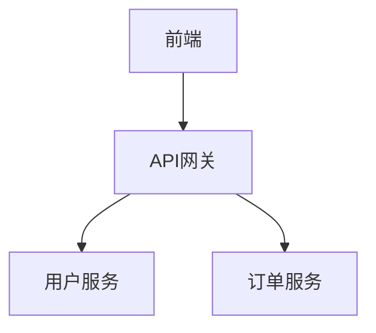
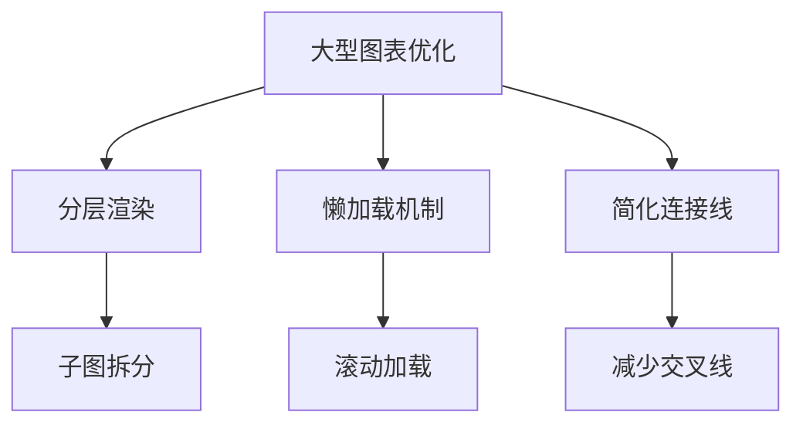

## 一、Mermaid技术全景解析

Mermaid是一种基于JavaScript的**声明式图表生成工具**，通过简洁的文本语法即可快速创建流程图、时序图、甘特图等专业图表。其核心价值在于将可视化内容代码化，实现**版本可控、自动化生成、跨平台协作**的现代化文档工作流。


### 1.1 技术架构
- **渲染引擎**：基于Web的SVG/Vue渲染器
- **语法解析器**：自定义DSL（领域特定语言）解析
- **集成接口**：支持VS Code、Notion、Confluence等30+平台

### 1.2 发展历程
| 版本 | 年份 | 里程碑 |
|------|------|--------|
| v1.0 | 2014 | 基础流程图支持 |
| v7.0 | 2019 | 引入状态图/类图 |
| v8.0 | 2021 | 实时协作编辑 |
| v9.0 | 2023 | AI辅助图表生成 |

---

## 二、核心功能深度剖析

### 2.1 主要图表类型对比

| 图表类型 | 语法关键词 | 典型应用场景 |
|----------|------------|--------------|
| 流程图 | `graph TD` | 业务流程/算法流程 |
| 时序图 | `sequenceDiagram` | 系统交互/通信协议 |
| 甘特图 | `gantt` | 项目计划/进度管理 |
| 类图 | `classDiagram` | 软件架构设计 |
| 状态图 | `stateDiagram` | 系统状态转换 |

### 2.2 基础语法结构



**要素解析**：
- `graph LR`：定义方向（Left-to-Right）
- `A[节点]`：矩形节点
- `B{菱形}`：判断节点
- `-->`：单向连接线
- `--|文本|-->`：带标签的连接

---

## 三、典型应用场景实战

### 3.1 软件架构设计（类图示例）



**优势体现**：
- 快速原型设计
- 团队协作沟通
- 文档自动生成

### 3.2 系统交互时序（时序图示例）



**典型用途**：
- API接口文档
- 微服务调用链
- 性能瓶颈分析

---

## 四、代码集成与自动化

### 4.1 VS Code集成方案
1. 安装插件：**Markdown Preview Mermaid Support**
2. 创建`.md`文件：
```markdown
# 系统架构文档


```
3. 实时预览：Ctrl+Shift+V

### 4.2 GitLab CI/CD集成
```yaml
stages:
  - docs

generate_docs:
  stage: docs
  image: node:16
  script:
    - npm install @mermaid-js/mermaid-cli
    - mmdc -i input.mmd -o output.svg
  artifacts:
    paths:
      - output.svg
```

---

## 五、优缺点全景分析

### 5.1 核心优势
| 优势维度 | 具体表现 |
|----------|----------|
| **开发效率** | 文本修改即时生效，节省80%绘图时间 |
| **版本控制** | Diff对比清晰可见，告别二进制文件冲突 |
| **跨平台性** | 支持Web/桌面/移动端全平台渲染 |
| **可访问性** | 屏幕阅读器友好，符合WCAG 2.1标准 |

### 5.2 现存局限性
| 挑战类型 | 具体问题 | 应对方案 |
|----------|----------|----------|
| **复杂布局** | 多级嵌套图表易混乱 | 拆分模块化设计 |
| **样式定制** | 默认主题选项有限 | CSS注入扩展 |
| **动态数据** | 静态语法限制 | 结合JavaScript动态生成 |
| **学习曲线** | 特殊符号语法需适应 | 使用在线编辑器练习 |

---

## 六、高级功能实战

### 6.1 动态图表生成（JavaScript API）
```javascript
const mermaid = require('mermaid');

mermaid.initialize({ startOnLoad: true });

const config = `
graph TD
    A[数据采集] --> B[实时处理]
    B --> C{异常检测}
    C -->|是| D[告警通知]
    C -->|否| E[数据存储]
`;

mermaid.render('dynamic-chart', config, (svgCode) => {
    document.getElementById('chart-container').innerHTML = svgCode;
});
```

### 6.2 甘特图项目规划
```mermaid
gantt
    title 产品研发里程碑
    dateFormat  YYYY-MM-DD
    section 核心开发
    需求分析       :done,    des1, 20XX-01-01, 7d
    架构设计       :active,  des2, 20XX-01-08, 5d
    模块开发       :         des3, 20XX-01-13, 14d
    section 测试验证
    单元测试       :         test1, 20XX-01-27, 5d
    集成测试       :         test2, 20XX-01-31, 7d
```

---

## 七、未来发展趋势

### 7.1 技术演进路线
- **AI增强**：自然语言转图表（NLP2Mermaid）
- **三维可视化**：支持立体架构图
- **实时协作**：多人在线编辑冲突解决
- **AR/VR集成**：三维空间图表展示

### 7.2 行业应用展望
| 领域 | 应用场景 | 价值体现 |
|------|----------|----------|
| 教育 | 在线课程流程图 | 提升知识可视化 |
| 医疗 | 诊疗流程标准化 | 降低沟通成本 |
| 制造 | 生产线流程优化 | 减少停机时间 |
| 金融 | 风控决策树 | 增强合规审计 |

---

## 八、最佳实践指南

### 8.1 可维护性设计原则
1. **模块化拆分**：单个图表节点不超过15个
2. **命名规范化**：使用`模块_功能`命名规则
3. **版本注释**：添加`%% 更新日期: 20XX-02-20 %%`头注释
4. **配色方案**：定义企业级颜色变量

### 8.2 性能优化技巧




---

Mermaid正在重新定义技术文档的创作方式，其**代码即文档**的理念完美契合DevOps时代的协作需求。通过本文的深度解析，开发者可以掌握从基础绘图到高级集成的全栈技能，在API文档、架构设计、项目管理等领域实现效率革命。随着AI技术的融合，Mermaid未来有望成为智能文档生态的核心组件，进一步降低技术传播的认知门槛。建议团队立即尝试在Confluence/Wiki中部署Mermaid，体验可视化文档的便捷与高效。