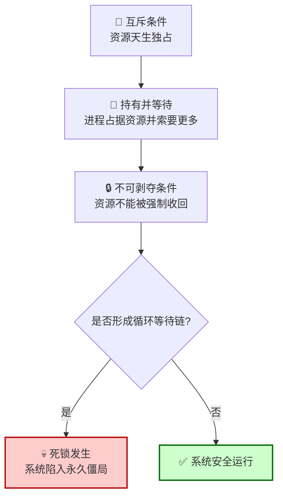

在并发系统和分布式计算的复杂世界中，**死锁**是一种令人头疼且具有破坏性的状态。它描述了两个或多个进程（或线程）因竞争有限资源而陷入的永恒等待僵局——每个进程都持有部分资源，同时无休止地等待其他进程释放其所需要的剩余资源，从而导致整个系统或局部功能完全停滞。

理解死锁，不仅是掌握计算机科学的核心课题，更是设计任何涉及资源共享的可靠系统时必须穿越的“雷区”。

### **一、核心定义与经典类比**

想象一个狭窄的单行桥，两辆汽车从对面同时驶上桥，并在桥中央相遇。每辆车都占据了道路的一半，且都需要对方后退让出空间才能通过。如果双方司机都拒绝倒车，坚持要求对方先退，那么两辆车将永远僵持在原地，无法前进也无法后退——这就是现实世界中的“死锁”。

在计算机科学中，死锁的经典模型是 **“哲学家就餐问题”** 。五位哲学家围坐圆桌，每人面前有一碗饭，但只有五根筷子（每两人之间放一根）。哲学家只有同时拿到左右两边的筷子才能吃饭。如果所有哲学家同时拿起自己左边的筷子，那么每人将持有一根筷子，并永远等待右边的人放下筷子——而右边的人也在同样等待。于是，所有哲学家都将陷入无限的饥饿等待中。

### **二、死锁产生的四个必要条件**

死锁的发生并非偶然，它需要同时满足以下四个必要条件，缺一不可：

1.  **互斥**：资源不能被共享，一次只能由一个进程独占使用。
2.  **持有并等待**：一个进程在持有至少一个资源的同时，又在等待获取其他进程持有的额外资源。
3.  **不可剥夺**：资源只能由持有它的进程自愿释放，不能被系统强行收回。
4.  **循环等待**：存在一个进程资源的循环等待链。例如，进程P1等待P2持有的资源，P2等待P3持有的资源，……，Pn又回头等待P1持有的资源。

这四个条件构成了死锁的完美风暴。其中，“循环等待”是最直观的表现，但根本原因在于系统设计允许了“持有并等待”和“不可剥夺”的情况发生。

为了更清晰地理解死锁从条件酝酿到最终僵局形成的动态过程，下图揭示了其标准路径与可能的打破点：

上图清晰展示了死锁形成的递进关系。任何策略若能**打破四个条件中的至少一个**，就能从根源上预防死锁。例如：
*   **破坏“持有并等待”**：要求进程一次性申请所有所需资源，否则什么也得不到。
*   **破坏“不可剥夺”**：系统可强行收回已分配资源（代价高，需状态恢复）。
*   **破坏“循环等待”**：为所有资源类型强制规定一个全局的申请顺序。

### **三、解决死锁的系统性策略**

面对死锁，操作系统和系统设计师主要采用三大类策略，各有其哲学和取舍：

| 策略 | 核心思想 | 常见方法 | 优点 | 缺点 |
| :--- | :--- | :--- | :--- | :--- |
| **死锁预防** | **保守策略**：通过设计，确保系统**根本不可能**进入死锁状态。即直接破坏四大必要条件的至少一个。 | 1. **破坏互斥**：将部分资源改造为可共享（如只读文件）。 2. **破坏“持有并等待”**：进程必须一次性申请所有资源（“全有或全无”）。 3. **破坏“不可剥夺”**：允许系统强制收回资源。 4. **破坏“循环等待”**：强制资源按全局线性顺序申请。 | 彻底、安全，无运行时开销。 | **资源利用率低，限制多，可能饿死进程**。例如，一次性申请所有资源极不灵活。 |
| **死锁避免** | **动态策略**：系统在每次分配资源前进行**安全性检查**，仅当分配后系统仍处于安全状态（即存在一个能让所有进程顺利完成的安全序列）时才进行分配。 | **银行家算法**：模拟资源分配，检查是否会进入不安全状态。 | **比预防更灵活，资源利用率更高**。 | **需要预先知道进程的最大资源需求；计算有开销；不适用于资源类型多变的场景**。 |
| **死锁检测与恢复** | **开放策略**：允许系统**进入死锁**，但会定期运行检测算法来发现死锁，一旦发现则采取措施恢复。 | 1. **检测**：使用资源分配图或等待图算法来发现循环等待。 2. **恢复**：    - **进程终止**：强制终止一个或多个死锁进程。    - **资源剥夺**：从一个进程中剥夺资源给另一个进程，需处理被剥夺进程的状态回滚。 | **资源利用率最高，对进程限制最少**。 | **检测与恢复有开销；恢复可能导致工作丢失，选择终止哪个进程是难题**。 |

此外，许多通用操作系统（如Windows、Linux）对用户进程采用了 **“鸵鸟算法”** ：即**忽略死锁问题**，假装它永远不会发生。这并非愚蠢，而是基于一种权衡：考虑到死锁在用户程序中并不频繁，且预防、避免或检测死锁的**开销远超处理罕见死锁的代价**。当真的发生死锁时，用户可以手动终止进程。这种方法将处理责任从系统内核转移到了应用程序开发者和用户身上。

### **四、现实世界的死锁与启示**

死锁的概念早已超越计算机科学，成为描述复杂系统中僵局现象的通用隐喻。

- **交通系统**：前文提到的十字路口或单行桥拥堵，就是典型的死锁。
- **企业管理与工作流程**：当A部门等待B部门的审批才能推进，而B部门的审批又需要A部门先提供某个报告时，就可能形成组织死锁。
- **国际关系与谈判**：在多方谈判中，如果每一方都坚持要求对方先做出让步，谈判就会陷入死锁。

从这些跨领域的现象中，我们可以得到对系统设计的深刻启示：

1.  **引入超时与重试机制**：这是破坏“无限等待”的最常见工程实践。当等待超过阈值，进程主动放弃并回滚操作，释放资源。这本质上是将“死锁”降解为可恢复的“临时性错误”。
2.  **定义清晰的资源获取顺序**：在代码层面，始终按照一个全局约定的顺序（如按内存地址排序）申请锁，可以彻底消灭循环等待。这是预防死锁最实用、最重要的编程纪律。
3.  **减少锁的粒度与持有时间**：尽量缩小临界区，使用更细粒度的锁（如读写锁），或采用无锁数据结构，从根本上减少资源竞争和相互等待的机会。
4.  **设计可剥夺或事务性操作**：让操作具备可回滚性，如同数据库事务一样，当系统需要时，可以安全地终止或回滚某个进程的操作以释放资源。

### **结语：与不确定性共存的系统智慧**

死锁问题深刻地揭示了**确定性与非确定性、安全与效率、严格与灵活**之间的永恒张力。完美的预防方案往往导致系统笨重低效，而纯粹的自由放任则可能引发灾难性停滞。

因此，现代系统设计的智慧不在于追求绝对的、零代价的安全，而在于**根据上下文进行明智的权衡**：在操作系统的核心底层采用预防和避免策略以保证稳定；在数据库等高价值系统中采用检测与复杂恢复机制以保证数据一致性和高利用率；在应用层面则通过编程规范（如锁顺序）、超时和监控来管理风险。

死锁提醒我们，任何涉及资源共享的协作系统，其顺畅运行都依赖于精心设计的规则和打破僵局的预案。它最终教会我们的，是在一个充满互斥与等待的世界里，如何通过设计，让系统既能勇敢地并发前行，又能在陷入僵局时，保有安全恢复、重新启动的能力。这正是系统思维中最具挑战性也最迷人的部分。