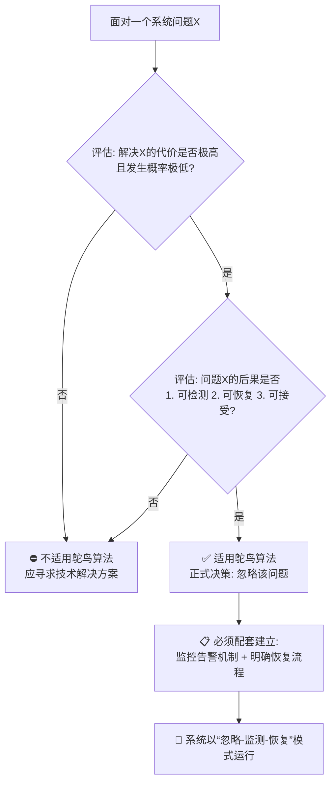

在计算机科学直面难题的万神殿中，“鸵鸟算法”或许是最坦诚、最反直觉，却又最广泛应用的一种策略。它得名于鸵鸟在危险时将头埋入沙中的传说——**并非真以为危险消失，而是选择暂时忽略它**。在系统设计中，这并非一种懒惰或愚蠢，而是一种基于成本收益分析的、深思熟虑的**工程权衡**。

### **一、核心定义：一种承认限制的工程哲学**

鸵鸟算法的官方名称是 **“忽略问题策略”** 。其核心理念可概括为：
> **如果解决一个问题的代价，超过了问题本身发生所带来的损失，并且问题发生的概率足够低，那么最经济的做法就是——不去解决它，而是在它发生时承担后果。**

这不是回避问题，而是**重新定义问题**：将“如何预防/检测X”转换为“处理X的代价是否值得我们投入资源去预防/检测”。

**关键公式：**
`期望损失 = 问题发生概率 × 单次问题造成的损失`
`总成本 = 预防/检测机制的代价 + 期望损失`

鸵鸟算法的决策是：当**预防/检测机制的代价 > 期望损失**时，选择不实施该机制。

### **二、经典应用场景**

#### **1. 操作系统中的死锁处理**
这是鸵鸟算法最著名的应用。我们在探讨死锁时已了解其复杂性。
*   **对比方案**：死锁预防（如严格排序）限制灵活，死锁避免（如银行家算法）开销巨大，死锁检测与恢复实现复杂。
*   **鸵鸟策略**：绝大多数通用操作系统（如Linux、Windows的桌面/服务器内核）对用户进程间的死锁**不提供主动预防、避免或检测**。它们假设：
    1.  死锁在用户程序中**并不常见**。
    2.  用户有能力也有责任处理自己程序的死锁（如通过`kill`命令终止进程）。
    3.  为小概率事件在**内核中增加复杂性和运行时开销**，会损害绝大多数正常情况下的性能。
*   **实际后果**：当死锁真的发生时，用户或监控系统会发现进程“卡死”，并手动干预。系统将处理死锁的**责任和成本，从内核转移给了应用程序开发者和用户**。

#### **2. 编程语言中的未定义行为**
在C/C++等语言中，对“未定义行为”的处理是鸵鸟算法的另一典范。
*   **问题**：数组越界、空指针解引用等行为，编译器在编译时无法完全检测，在运行时完全检测则开销巨大。
*   **鸵鸟策略**：语言标准直接声明这些行为是“未定义的”。这意味着编译器**无需插入昂贵的边界检查代码**，可以生成极其高效的机器码。
*   **实际后果**：程序可能崩溃、产生错误结果或表现出不可预测的行为。责任完全在于程序员必须编写安全的代码，或使用额外的工具（如调试器、静态分析器）来捕获问题。用**性能换取安全责任的外包**。

#### **3. 分布式系统中的一致性妥协**
在CAP定理的约束下，许多分布式数据库在网络分区期间选择 **“最终一致性”** 而非“强一致性”。
*   **问题**：保证跨所有节点的强一致性，需要在每次写操作时进行昂贵的同步协调，这会严重影响可用性和性能。
*   **鸵鸟策略**：暂时“忽略”所有节点数据不一致的问题，允许在一段时间内读取到旧数据。
*   **实际后果**：系统获得了极高的写入可用性和性能。不一致的“问题”被延迟解决（通过后台异步同步），而用户在许多场景下（如社交动态点赞数）可以容忍这种短暂的不一致。这是**用短暂的数据不一致风险，换取核心的可用性与性能**。

### **三、算法背后的“务实主义”哲学**

鸵鸟算法之所以能成为工程实践中的默认真实，源于以下几个深刻洞察：

1.  **没有完美的系统**：所有工程都是折中的艺术。资源（CPU时间、内存、开发人力、系统复杂性）永远是有限的。将稀缺资源投入到最有可能产生最大收益的地方，是最高效的策略。
2.  **故障是常态，而非例外**：在复杂系统中，试图预防所有故障是不可能的。与其追求脆弱的“完美预防”，不如构建鲁棒的“故障应对”机制。鸵鸟算法常常与**监控、告警和恢复流程**配套使用，形成一个完整的策略：允许故障发生，但确保能快速发现并修复。
3.  **用户体验的全局最优**：有时，为了处理一个罕见问题而强加给所有用户的延迟或复杂性（例如，每次内存访问都检查边界），会损害绝大多数用户的日常体验。选择“不处理”反而带来了更流畅的全局体验。
4.  **责任的合理分层**：将某些问题的处理责任推到栈的更高层（如从操作系统推到应用程序，从编译器推到程序员），可以简化底层系统的设计，使其更高效、更稳定。这要求上层具备相应的能力。

### **四：适用与不适用：决策框架**

鸵鸟算法绝非万能。是否采用，需严格评估以下条件：

**✅ 适用场景（通常同时满足）：**
*   **问题发生概率极低**。
*   **检测或预防问题的成本极高**（严重影响性能、复杂度或开发周期）。
*   **问题发生的后果可接受、可检测、且可恢复**（如进程崩溃可重启，短暂不一致可同步）。
*   **存在更高层、更低成本的应对机制**（如用户干预、定期重启、事后补偿）。

**❌ 不适用场景（触发任一即应避免）：**
*   **问题后果灾难性、不可逆**：如航天控制软件中的死锁、金融交易系统的数据丢失。
*   **问题发生概率高**：会成为常态而非例外。
*   **责任无法有效转移**：上层不具备处理能力，或最终用户无法承担后果。
*   **存在简单、廉价的解决方案**：如果预防成本很低，则没有理由忽略。

一个简明的决策流程图可以清晰地勾勒出这一权衡过程：

### **五、现代演变：从被动忽略到主动管理**

今天的“鸵鸟算法”已不仅仅是简单的忽略，而是进化为一套更精细的 **“选择性忽略与智能应对”** 体系：
*   **混沌工程**：Netflix等公司主动在生产环境中“忽略”部分稳定性，注入故障（如随机关闭服务），以验证系统的恢复能力是否符合预期。这是**将鸵鸟策略从被动转为主动，化弱点为测试工具**。
*   **降级与熔断**：在微服务架构中，当某个依赖服务出现问题时，系统会主动“忽略”对该服务的请求（熔断），并返回降级内容（如默认值、缓存数据），避免级联故障。这是**在局部采用鸵鸟策略（忽略部分功能），以保全系统整体**。
*   **概率型算法与数据结构**：如布隆过滤器，它允许一定的误判率，以此换来常数级的查询效率和极小的内存占用。这是**明确用可量化、可控制的小错误概率，换取巨大的性能与空间收益**。

### **结语：明智的妥协而非软弱的逃避**

鸵鸟算法揭露了一个深刻的工程现实：**在复杂系统设计中，有时最正确的做法，就是承认某些问题我们决定不去解决。** 它不是技术上的失败，而是资源分配和风险管理的成熟体现。

它教会我们，卓越的系统设计不在于构建一个无懈可击的堡垒，而在于做出清醒的权衡——知道在哪里该投入重兵布防，又在哪里可以敞开大门，因为你知道即便失守，你也有一套更经济的方案来清理战场。这是一种在**不完美世界中实现最优解的务实智慧**，是对“完美主义”的一种必要且健康的反抗。

最终，鸵鸟算法的精神可以归结为一句工程格言：**“追求简单，但接受复杂；预防可预防的，监控可监控的，忽略可忽略的。”** 这或许是所有系统设计者，在面对无限需求与有限资源的永恒矛盾时，所能拥有的最清醒的头脑。