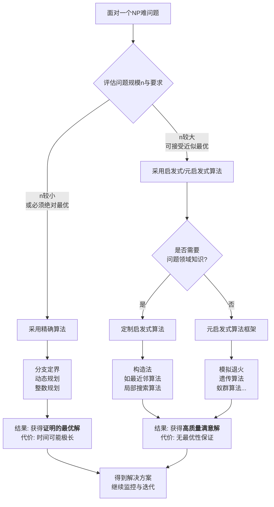

在计算机科学的核心地带，存在着一类令人着迷又深感困扰的问题，它们被统称为 **NP难（NP-hard）问题**。它们是算法研究领域的“珠穆朗玛峰”，代表着人类在当前计算范式下面临的终极挑战。理解NP难问题，不仅是理解计算机科学的理论边界，更是理解为何我们需要在“完美”与“可行”之间做出至关重要的权衡。

### **一、问题定义：当“组合爆炸”遇见“高效验证”**

要理解NP难，首先需要了解两个关键概念：**P类问题**和**NP类问题**。

- **P类问题**：指那些可以在**多项式时间**内被**确定性图灵机**（可以简单理解为我们的常规计算机）**解决**的问题。“多项式时间”意味着问题规模n增加时，所需计算时间增长可控，如n²或n³。例如，排序一个数组就是P问题。
- **NP类问题**：指那些可以在多项式时间内被**验证**一个给定解是否正确的问题。注意，这里的关键是“验证”而非“求解”。例如，著名的“旅行商问题”（TSP）：给定一个城市列表和两两之间的距离，要求找到一条访问每个城市恰好一次并返回起点的最短回路。**验证**一条特定路径是否短于某个长度k是容易的（只需加总距离即可），但**找出**这条最短路径本身却极其困难。

**NP难问题的精确定义是**：如果任何一个NP问题都可以在多项式时间内“归约”为问题X，那么X就是NP难问题。归约，如同一座桥梁，意味着如果我们能高效解决X，那么我们就能够高效解决所有NP问题。**NP完全问题**则是NP难问题中与NP问题“难度相等”的子集，它们既是NP难的，本身也属于NP类（即其解可被高效验证）。

通俗地讲，NP难问题的共同特征是：**随着问题规模稍微扩大（例如城市数量从30个增加到60个），寻找其最优解所需尝试的可能性数量会呈指数级爆炸，超越了任何现代计算机在可接受时间内（例如宇宙寿命内）能够完成穷举搜索的极限。**

### **二、核心特征：为什么它们如此棘手？**

NP难问题并非遥不可及的数学抽象，它们具有以下鲜明的、令工程师头疼的特征：

1.  **组合爆炸**：这是最根本的特征。问题的解空间巨大。对于TSP，n个城市的可能路径是(n-1)!/2条。当n=30时，路径数量约为4.4×10³⁰条。即使使用每秒能检验一万亿条路径的超算，也需要远超宇宙年龄的时间才能检查完毕。
2.  **全局约束与局部决策的强耦合**：问题的每一个局部决策（例如先去A城还是B城）都会深刻影响整个解的结构和最终质量，无法孤立地优化。这种高度的相互依赖性使得“分而治之”等经典高效策略失效。
3.  **缺乏明显的数学结构**：许多NP难问题（如布尔可满足性问题）的解空间像一片崎岖的“高原”，布满无数局部最优解，而没有清晰的数学梯度可以引导搜索直达全局最优。

### **三、无处不在：现实世界中的NP难问题**

NP难问题的可怕与魅力在于，它们绝非理论玩具，而是广泛存在于现代工业与科技的核心环节：

- **物流与调度**：旅行商问题、车辆路径问题、作业车间调度问题。这是亚马逊、联邦快递等公司每日必须面对的核心优化挑战，直接影响数十亿美元的运营成本。
- **集成电路与芯片设计**：电路板布线、门电路最小化、芯片布局规划。芯片上数十亿晶体管的排列与连接，是NP难问题的典型体现。
- **资源分配与规划**：背包问题（如何选择物品使总价值最大但不超过承重）、装箱问题、人员排班问题。
- **网络与通信**：网络中的最优路由选择、数据包调度、无线频谱分配。
- **人工智能与机器学习**：特征选择、神经网络结构搜索、超参数优化等任务，本质上也是在高维离散空间中寻找最优解。
- **生物信息学**：DNA序列比对、蛋白质结构预测。

可以说，**NP难问题是效率世界的“暗物质”，虽然看不见，但其引力塑造了整个现代计算应用的基本形态**。

### **四、P与NP：悬而未决的千年难题**

NP难问题的理论核心围绕着一个悬而未决的世纪猜想：**P 是否等于 NP？**

- 如果 **P = NP**，意味着所有易于验证解的问题，也同样易于找到解。这将引发一场科技革命：许多现在被认为棘手的问题（从药物设计到数学证明）都将迎刃而解，现代密码学的基础将崩塌。
- 绝大多数计算机科学家相信 **P ≠ NP**。这意味着，存在着一类本质上就无法被常规计算机快速解决的问题，NP难问题正在此列。

这个猜想是克雷数学研究所公布的七个“千禧年大奖难题”之一，悬赏百万美元。它不仅是理论计算机科学的皇冠，更深刻地指向了“创造性发现”与“机械验证”之间的根本性差异。

### **五、应对策略：与“困难”共存的智慧**

既然无法在多项式时间内找到精确最优解，人类发展出了一整套精妙的应对策略。这些策略的本质，是在**求解时间**、**解的质量**和**问题规模**之间进行精明的权衡。

如图所示的决策流程清晰地揭示了我们的应对哲学。对于**精确算法**，其价值在于为小规模问题或关键应用提供黄金标准，但其局限性在规模面前暴露无遗。

正因如此，**启发式与元启发式算法**成为了解决大规模现实NP难问题的中流砥柱。它们放弃了“绝对最优”的奢望，转而运用智能搜索策略（如模拟自然进化、物理过程或群体智能），在浩瀚的解空间中高效地勘探出“富矿带”（高质量满意解）。这正是我们此前深入探讨的遗传算法、模拟退火等技术的用武之地。

### **六、前沿展望：超越经典计算**

面对NP难的壁垒，科学界也在探索全新的破局路径：

1.  **量子计算**：利用量子比特的叠加和纠缠特性，理论上可在某些NP难问题上实现指数级加速。量子退火机已被用于探索组合优化问题，尽管其通用性和优势范围仍在界定中。
2.  **近似算法理论**：为某些NP难问题设计在多项式时间内总能找到解，且该解与最优解之比有**可证明上界**的算法。例如，某些版本的TSP存在1.5倍近似算法。
3.  **专用硬件与异构计算**：使用GPU、FPGA甚至ASIC芯片，通过大规模并行处理来加速特定启发式算法的运行，实现“暴力智慧”。
4.  **人工智能增强**：利用机器学习模型来学习复杂问题的结构，预测优质解的区域，或直接指导启发式算法的搜索策略，形成“学习+优化”的新范式。

### **结语：在复杂性的深渊上架桥**

NP难问题如同一面镜子，映照出人类理性的光辉与局限。它们告诉我们，世界本质上是复杂的，许多最优决策在计算上是不可及的。然而，正是这种不可及性，催生了人类非凡的创造力——从放弃完美转向寻求足够好，从盲目穷举转向智能引导。

对NP难问题的研究，其终极目的或许不是等待一个“P=NP”的神迹，而是在承认限制的前提下，不断拓展我们**解决问题的能力边界**。它是一门在复杂性的深渊之上，用智慧、算法和计算力架设桥梁的艺术。每一次物流成本的降低、芯片效能的提升、新药研发周期的缩短，都是这座桥梁向前延伸的证明。在这个意义上，与NP难问题的共存和斗争，正是人类技术文明进步的一个核心叙事。